<div align="center">

  <!-- Official Brand Cover Banner -->
  <a href="https://abunayem.com" target="_blank">
    
  </a>

  <br /><br />

  # ABU NAYEM
  ### **AI-Powered Full-Stack Developer**
  
  <p align="center">
    <strong>Building AI × Web × Automation</strong>
  </p>

  <!-- Navigation & Action Badges Table -->
  <table border="0" cellspacing="6" cellpadding="0">
    <tr>
      <td align="center">
        <a href="https://abunayem.com" target="_blank">
          
        </a>
      </td>
      <td align="center">
        <a href="https://www.linkedin.com/in/nayem2004/" target="_blank">
          
        </a>
      </td>
      <td align="center">
        <a href="mailto:abunayem.programmer@gmail.com">
          
        </a>
      </td>
      <td align="center">
        <a href="https://wa.me/8801764467266" target="_blank">
          
        </a>
      </td>
    </tr>
  </table>

  <br />

  <p align="center">
    
    
  </p>

</div>

---

### 👨‍💻 ABOUT ME

> *“Code. Create. Automate. Elevate.”*

I am an **AI-Powered Full-Stack Developer** based in **Khulna, Bangladesh**, currently engineering scalable web architectures and intelligent digital solutions at **Etarnity Global**. My passion lies at the convergence of **intuitive frontend design**, **high-throughput backend systems**, and **autonomous AI-driven automation**.

With deep expertise spanning modern JavaScript, React 19, Next.js 15, Python, and cloud services, I bridge the gap between human imagination and machine precision—shipping production-grade web applications that deliver measurable value.

- 🔭 **Currently Exploring**: Next.js 15 Server Actions, React 19 Server Components, and multi-agent tool-calling architectures.
- 💼 **Active Endeavors**: Developing full-stack AI SaaS platforms and growing the **Pixel Programmers** collaborative community.
- ⚡ **Core Philosophy**: Fast execution, resilient clean code, user-first micro-interactions, and security by default.
- 🌱 **Beyond the Screen**: Tech community mentor, open-source contributor, continuous learner, and relentless builder.

---

### ⚡ CURRENTLY BUILDING

> *Engineering intelligent digital products at the intersection of AI, Modern Web & Business Automation.*

<br />

<table border="0" cellspacing="10" cellpadding="0">
  <tr>
    <td width="33.3%" valign="top">
      <h4>🤖 Autonomous AI Agents</h4>
      <p>Architecting self-directed multi-agent workflows, tool-calling executors, and context-aware RAG assistants.</p>
    </td>
    <td width="33.3%" valign="top">
      <h4>⚡ Modern Full-Stack Apps</h4>
      <p>Developing lightning-fast, scalable digital products utilizing <b>Next.js 15</b>, <b>React 19</b>, TypeScript, and APIs.</p>
    </td>
    <td width="33.3%" valign="top">
      <h4>🔄 Workflow Automation</h4>
      <p>Engineering intelligent background worker pipelines that eliminate repetitive tasks and scale business velocity.</p>
    </td>
  </tr>
</table>

<br />

| Domain | Profile & Status |
| :--- | :--- |
| 🏢 **Current Engagement** | Full-Stack & Modern Web Engineering at **Etarnity Global** |
| 📍 **Base Location** | Based in **Khulna, Bangladesh 🇧🇩** *(Collaborating with global clients & teams)* |
| 🎯 **Core Focus** | Bridging generative artificial intelligence with intuitive, production-grade web systems |

---

### 🛠️ TECH STACK

> *Architecting scalable digital systems with modern full-stack technologies, cloud infrastructure & AI frameworks.*

<br />

<table border="0" cellspacing="10" cellpadding="0">
  <tr>
    <!-- Frontend -->
    <td width="50%" valign="top">
      <h4>🌐 Frontend & UI Architecture</h4>
      <p>
        
      </p>
      <p>
        <b>Core Frameworks:</b> Next.js 15 (App Router), React 19, TypeScript, ES6+<br />
        <b>Design Systems:</b> Tailwind CSS, Modern CSS3, Fluid Responsive UI<br />
        <b>Specialization:</b> Server Components (RSC), SSR Streaming, State Architecture
      </p>
    </td>
    <!-- Backend -->
    <td width="50%" valign="top">
      <h4>⚙️ Backend & API Engineering</h4>
      <p>
        
      </p>
      <p>
        <b>Runtimes & Frameworks:</b> Node.js, Express.js, Python, REST APIs<br />
        <b>Data Layers:</b> PostgreSQL, MongoDB, Schema Modeling, Connection Pooling<br />
        <b>Specialization:</b> Microservice Patterns, Authentication, High-Throughput APIs
      </p>
    </td>
  </tr>
  <tr>
    <!-- AI & Automation -->
    <td width="50%" valign="top">
      <h4>🤖 AI Engineering & Autonomous Agents</h4>
      <p>
        
        
        
      </p>
      <p>
        <b>Agentic Frameworks:</b> Tool Calling, Multi-Agent Orchestration, State Machines<br />
        <b>Context Systems:</b> RAG Pipelines, Vector Search, Structured Outputs<br />
        <b>Specialization:</b> Autonomous Goal Executors & Intelligent Software Assistants
      </p>
    </td>
    <!-- Cloud & Tooling -->
    <td width="50%" valign="top">
      <h4>☁️ Cloud, DevOps & Developer Workflow</h4>
      <p>
        
      </p>
      <p>
        <b>Cloud & BaaS:</b> Vercel, Supabase, Firebase, Cloudflare Workers<br />
        <b>DevOps & CI/CD:</b> Docker Containers, GitHub Actions Workflows, Git<br />
        <b>Specialization:</b> Automated Deployments, Serverless Scaling, Developer Velocity
      </p>
    </td>
  </tr>
</table>

---

### 🚀 FEATURED PROJECTS

> *Production systems, autonomous AI agents & modern web applications built for scale.*

<br />

<table border="0" cellspacing="12" cellpadding="0">
  <tr>
    <!-- Project 1: AI Agent -->
    <td width="50%" valign="top">
      <h3>🤖 Autonomous Task Agent</h3>
      <p>
        
        
      </p>
      <p>
        Self-directed autonomous agent capable of browsing the web, executing multi-step tool calls, and synthesizing structured business insights.
      </p>
      <p>
        <b>Tech Stack:</b> <code>Python</code> <code>LangChain</code> <code>Tool Calling</code> <code>FastAPI</code>
      </p>
      <p>
        <a href="https://github.com/abunayem04" target="_blank">
          
        </a>
      </p>
    </td>
    <!-- Project 2: AI SaaS -->
    <td width="50%" valign="top">
      <h3>⚡ Intelligent SaaS Platform</h3>
      <p>
        
        
      </p>
      <p>
        Cloud-native multi-tenant SaaS application integrating multi-modal AI models for real-time document analysis and automated content workflows.
      </p>
      <p>
        <b>Tech Stack:</b> <code>Next.js 15</code> <code>React 19</code> <code>TypeScript</code> <code>Tailwind</code>
      </p>
      <p>
        <a href="https://github.com/abunayem04" target="_blank">
          
        </a>
      </p>
    </td>
  </tr>
  <tr>
    <!-- Project 3: AI Chatbot -->
    <td width="50%" valign="top">
      <h3>💬 Context-Aware RAG Assistant</h3>
      <p>
        
        
      </p>
      <p>
        Enterprise support chatbot powered by dense vector embeddings, hybrid semantic retrieval, and contextual reranking to eliminate hallucinations.
      </p>
      <p>
        <b>Tech Stack:</b> <code>TypeScript</code> <code>Vector DB</code> <code>FastAPI</code> <code>OpenAI</code>
      </p>
      <p>
        <a href="https://github.com/abunayem04" target="_blank">
          
        </a>
      </p>
    </td>
    <!-- Project 4: Automation -->
    <td width="50%" valign="top">
      <h3>⚙️ Data & Automation Pipeline</h3>
      <p>
        
        
      </p>
      <p>
        Automated event-driven pipeline executing distributed background jobs, web scraping, data enrichment, and cross-platform synchronization.
      </p>
      <p>
        <b>Tech Stack:</b> <code>Node.js</code> <code>Python</code> <code>Cron Workers</code> <code>REST APIs</code>
      </p>
      <p>
        <a href="https://github.com/abunayem04" target="_blank">
          
        </a>
      </p>
    </td>
  </tr>
  <tr>
    <!-- Project 5: Web App -->
    <td width="50%" valign="top">
      <h3>🍽️ NX Restaurant Platform</h3>
      <p>
        
        
      </p>
      <p>
        Modern dining web application featuring dynamic real-time menu categorization, fluid interactive animations, and responsive booking interfaces.
      </p>
      <p>
        <b>Tech Stack:</b> <code>HTML5</code> <code>CSS3</code> <code>JavaScript</code> <code>UI/UX Design</code>
      </p>
      <p>
        <a href="https://github.com/abunayem04/NX-resturent" target="_blank">
          
        </a>
      </p>
    </td>
    <!-- Project 6: Developer Tool -->
    <td width="50%" valign="top">
      <h3>🛠️ Pixel Programmers Hub</h3>
      <p>
        
        
      </p>
      <p>
        Collaborative learning and resource hub built for junior developers and students to share curated roadmaps, cheat sheets, and coding exercises.
      </p>
      <p>
        <b>Tech Stack:</b> <code>HTML5</code> <code>CSS3</code> <code>JavaScript</code> <code>Responsive</code>
      </p>
      <p>
        <a href="https://github.com/abunayem04/pixel-programmers-" target="_blank">
          
        </a>
      </p>
    </td>
  </tr>
</table>

---

### 📊 DEVELOPER ACTIVITY

<div align="center">

  <p align="center">
    
    
    
  </p>

  <br />

  <table border="0" cellspacing="8" cellpadding="0">
    <tr>
      <td align="center" valign="top">
        
      </td>
      <td align="center" valign="top">
        
      </td>
    </tr>
    <tr>
      <td colspan="2" align="center" valign="top">
        <br />
        
      </td>
    </tr>
  </table>

</div>

---

### 🔬 NAYEM LABS

> **Experiments • Prototypes • Research**

- 🧪 **Autonomous Subagents**: Experimenting with hierarchical agent swarms for web data synthesis.
- 🔬 **Generative UI Prototypes**: Dynamically rendering React components streamed on-the-fly from LLM responses.
- 🧬 **Edge AI Execution**: Benchmarking local and edge model inference times for real-time web applications.
- 📂 Repository: **[Frontend Labs & Experiments](https://github.com/abunayem04/Practice-work)** — Sandbox for UI experiments and code explorations.

---

### 🌍 OPEN SOURCE

> **Contributions • PRs • Issues**

```text
✦ Community Mindset   : Actively contributing fixes, documentation, and features to open developer tools.
✦ Issue Auditing      : Reporting reproducible edge cases and participating in architectural discussions.
✦ Open Repositories   : Sharing boilerplates, component labs, and educational materials for the community.
```

- Feel free to review my public code, open issues, or submit PRs on any of my repositories!

---

### 📚 ENGINEERING NOTES

> **JavaScript • React • AI • System Design**

- **JavaScript (ES6+)**: Deep dive into the Event Loop, asynchronous microtasks, closures, and memory lifecycle.
- **React 19 & Next.js 15**: Transitioning to React Server Components (RSC), Actions, streaming SSR, and zero-bundle hydration.
- **AI Architecture**: Practical patterns for handling rate limits, context token optimization, and hallucination reduction.
- **System Design**: Modular architectures, decoupled services, caching layers, and database indexing strategies.

---

### 🏆 ACHIEVEMENTS

> **Projects • Certifications • Milestones**

- 🚀 **Full-Stack Deliveries**: Successfully designed and delivered production client web apps and digital platforms.
- 💼 **Industry Engagement**: Contributing to frontend engineering and digital solutions at **Etarnity Global**.
- 🌟 **Community Founder**: Created **Pixel Programmers** to help aspiring developers build real-world software.
- 📜 **Continuous Mastery**: Specialized certifications in Modern Full-Stack Development, React Architecture, and AI Tooling.

---

### 📈 MY JOURNEY

> **2025 → 2026 → 2027 → ...**

```text
  2025 ───► Mastered Core Full-Stack (HTML5, CSS3, JavaScript, React Ecosystem)
    │
  2026 ───► Engineering AI-Augmented Web Apps, Agentic Workflows & Automation Pipelines
    │
  2027+ ──► Pioneering Scalable Intelligent Systems, Global SaaS & Open Source Innovations
```

---

<!-- Contribution Grid Snake Arcade -->
<div align="center">
  <picture>
    <source media="(prefers-color-scheme: dark)" srcset="./assets/github-contribution-grid-snake-dark.svg">
    <source media="(prefers-color-scheme: light)" srcset="./assets/github-contribution-grid-snake.svg">
    
  </picture>
</div>

---

<div align="center">

  <!-- Master Quote & CTA Typography -->
  <h1>❝ <em>Build beyond the obvious.</em> ❞</h1>
  
  <h3><strong>Let's build something extraordinary together.</strong></h3>

  <p align="center">
    <em>Have an ambitious project, startup concept, or intelligent AI product in mind? Let's talk.</em>
  </p>

  <p align="center">
    <code>● STATUS: AVAILABLE FOR EXCITING PROJECTS</code>
  </p>

  <br />

  <!-- Symmetrical 3x2 Grid Contact Badges -->
  <table border="0" cellspacing="8" cellpadding="0">
    <tr>
      <td align="center">
        <a href="https://abunayem.com" target="_blank">
          
        </a>
      </td>
      <td align="center">
        <a href="https://www.linkedin.com/in/nayem2004/" target="_blank">
          
        </a>
      </td>
      <td align="center">
        <a href="mailto:abunayem.programmer@gmail.com">
          
        </a>
      </td>
    </tr>
    <tr>
      <td align="center">
        <a href="https://wa.me/8801764467266" target="_blank">
          
        </a>
      </td>
      <td align="center">
        <a href="https://www.facebook.com/abunayem04" target="_blank">
          
        </a>
      </td>
      <td align="center">
        <a href="https://www.instagram.com/abu_nayeeem/" target="_blank">
          
        </a>
      </td>
    </tr>
  </table>

  <br />

  <!-- Return to Top Modern Pill Button -->
  <a href="#nayem">
    
  </a>

  <br /><br />

  <!-- Animated Multi-Color Wave Matching Cover Theme -->
  

  <p align="center"><i>⭐ Code. Create. Automate. Elevate. • Khulna, Bangladesh ⭐</i></p>

</div>
