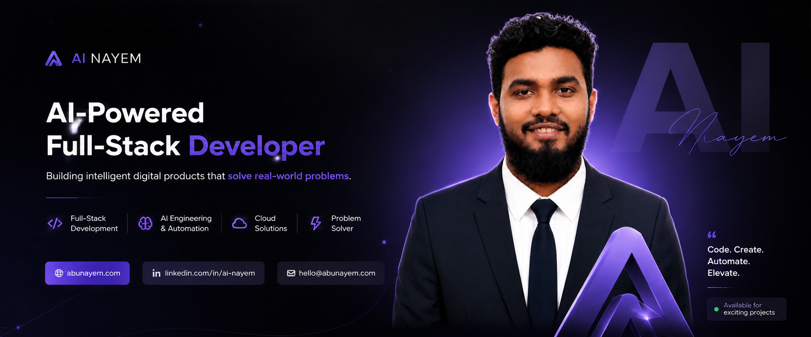
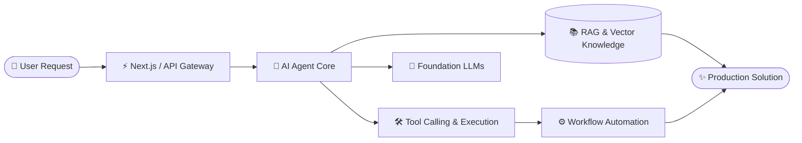

<div align="center">

  <!-- Official Brand Cover Banner -->
  <a href="https://abunayem.com" target="_blank">
    
  </a>

  <br /><br />

  # NAYEM
  ### **AI-Powered Full-Stack Developer**
  
  <p align="center">
    <strong>Building AI × Web × Automation</strong>
  </p>

  <p align="center">
    <a href="https://abunayem.com" target="_blank">
      
    </a>
    <a href="https://www.linkedin.com/in/ai-nayem/" target="_blank">
      
    </a>
    <a href="mailto:hello@abunayem.com">
      
    </a>
    <a href="https://wa.me/8801764467266" target="_blank">
      
    </a>
  </p>

  <p align="center">
    
    
  </p>

</div>

---

### ⚡ CURRENTLY BUILDING

> **AI Agents • Full-Stack Apps • Automation**

```text
✦ Autonomous AI Agents      : Building tool-calling multi-agent workflows and autonomous task executors
✦ Full-Stack Applications   : Developing performant, scalable web products with Next.js 15, React 19 & APIs
✦ Workflow Automation       : Engineering intelligent automation pipelines to eliminate repetitive business work
```

- 🏢 **Current Organization**: Engineering full-stack and modern web architectures at **Etarnity Global**.
- 📍 **Location**: Based in **Khulna, Bangladesh 🇧🇩** (Collaborating globally).
- 🎯 **Primary Focus**: Bridging generative AI with intuitive, production-grade web systems.

---

### 🛠️ TECH STACK

<div align="center">
  <p><strong>Frontend | Backend | AI | Cloud | Tools</strong></p>

  <p align="center">
    <a href="https://skillicons.dev">
      
    </a>
  </p>

  <p align="center">
    <a href="https://skillicons.dev">
      
    </a>
  </p>
</div>

<br />

| Domain | Core Technologies | Specialization |
| :--- | :--- | :--- |
| **Frontend** | `Next.js 15`, `React 19`, `TypeScript`, `JavaScript (ES6+)`, `Tailwind CSS`, `HTML5`, `CSS3` | App Router, Server Components, State Management, Responsive Design |
| **Backend** | `Node.js`, `Express.js`, `Python`, `FastAPI`, `RESTful APIs`, `GraphQL` | Scalable Microservices, API Engineering, Authentication |
| **AI & Automation** | `LLMs`, `RAG Systems`, `AI Agents`, `Tool Calling`, `Prompt Engineering`, `Python AI APIs` | Agentic Workflows, Structured Outputs, Context Augmentation |
| **Cloud & Database** | `MongoDB`, `PostgreSQL`, `Firebase`, `Vercel`, `Supabase`, `Cloudflare` | Data Modeling, Serverless Deployments, Cloud Infrastructure |
| **Tools & Workflow** | `Git`, `GitHub`, `Docker`, `VS Code`, `Postman`, `Figma`, `npm / yarn / pnpm` | CI/CD Pipelines, Agile Development, Code Optimization |

---

### 🚀 FEATURED PROJECTS

<div align="center">
  <p><strong>[ AI Agent ] • [ AI SaaS ] • [ AI Chatbot ] • [ Automation ] • [ Web App ] • [ Developer Tool ]</strong></p>
</div>

| Category | Project | Architecture & Description | Tech Stack | Links |
| :--- | :--- | :--- | :--- | :--- |
| 🤖 **AI Agent** | **Autonomous Task Agent** | Self-directed agent capable of browsing, researching, tool calling, and generating structured insights. | `Python` `AI Tools` `Automation` | [Source Code ➔](https://github.com/abunayem04) |
| ⚡ **AI SaaS** | **Intelligent Web Platform** | Cloud-native SaaS application integrating multi-modal AI models for automated content and workflow synthesis. | `Next.js 15` `React` `Tailwind` `AI APIs` | [Source Code ➔](https://github.com/abunayem04) |
| 💬 **AI Chatbot** | **Context-Aware Assistant** | Enterprise support chatbot powered by Retrieval-Augmented Generation (RAG) and domain knowledge embeddings. | `TypeScript` `Vector DB` `FastAPI` | [Source Code ➔](https://github.com/abunayem04) |
| ⚙️ **Automation** | **Data & Workflow Pipeline** | Automated background workers extracting data, processing leads, and synchronizing distributed services. | `Node.js` `Python` `Cron` `REST API` | [Source Code ➔](https://github.com/abunayem04) |
| 🍽️ **Web App** | **[NX Restaurant](https://github.com/abunayem04/NX-resturent)** | Responsive dining platform featuring dynamic menu filtering, interactive UI, and fluid reservation systems. | `HTML5` `CSS3` `JavaScript` `UI/UX` | [Explore Repo ➔](https://github.com/abunayem04/NX-resturent) |
| 🛠️ **Developer Tool** | **[Pixel Programmers](https://github.com/abunayem04/pixel-programmers-)** | Collaborative web learning portal engineered for developers and students to share resources and level up skills. | `HTML5` `CSS3` `JavaScript` `Responsive` | [Explore Repo ➔](https://github.com/abunayem04/pixel-programmers-) |

---

### 📊 DEVELOPER ACTIVITY

<div align="center">
  <p><strong>Contributions | Streak | PRs | Issues</strong></p>

  <table border="0" cellspacing="0" cellpadding="0">
    <tr>
      <td align="center" width="50%" valign="top">
        
      </td>
      <td align="center" width="50%" valign="top">
        
      </td>
    </tr>
    <tr>
      <td colspan="2" align="center" valign="top">
        
      </td>
    </tr>
  </table>

  <br />
  
  <!-- Contribution Graph Snake -->
  <picture>
    <source media="(prefers-color-scheme: dark)" srcset="https://raw.githubusercontent.com/abunayem04/abunayem04/output/github-contribution-grid-snake-dark.svg">
    <source media="(prefers-color-scheme: light)" srcset="https://raw.githubusercontent.com/abunayem04/abunayem04/output/github-contribution-grid-snake.svg">
    
  </picture>
</div>

---

### 🤖 AI ENGINEERING

> **LLM • RAG • Agents • Tool Calling**



- **LLM Integrations**: Designing prompt chains, structured JSON schemas, and multi-turn conversational agents.
- **RAG Systems**: Retrieval-Augmented Generation using vector search to ground models on dynamic private data.
- **Autonomous Agents**: Implementing loop-based reasoning, planning, memory, and autonomous decision-making.
- **Tool Calling**: Connecting AI directly to database querying, API requests, code execution, and third-party integrations.

---

### 🧠 ENGINEERING PRINCIPLES

```yaml
01 // Build for humans       : User experience and accessibility guide every architectural decision.
02 // Keep it simple         : Favor clear, readable code over clever, unmaintainable abstractions.
03 // Automate repetitive work: If a task must be done more than twice, write a script or build an agent.
04 // Security by default    : Validate inputs, protect credentials, enforce least-privilege policies.
05 // Ship → Measure → Improve: Build fast, measure real-world performance metrics, iterate continuously.
```

---

### 🔬 NAYEM LABS

> **Experiments • Prototypes • Research**

- 🧪 **Autonomous Subagents**: Experimenting with hierarchical agent swarms for web data synthesis.
- 🔬 **Generative UI Prototypes**: Dynamically rendering React components streamed on-the-fly from LLM responses.
- 🧬 **Edge AI Execution**: Benchmarking local and edge model inference times for real-time web applications.
- 📂 Repository: **[Frontend Labs & Experiments](https://github.com/abunayem04/Practice-work)** — Sandbox for UI experiments and code explorations.

---

### 🌍 OPEN SOURCE

> **Contributions • PRs • Issues**

```text
✦ Community Mindset   : Actively contributing fixes, documentation, and features to open developer tools.
✦ Issue Auditing      : Reporting reproducible edge cases and participating in architectural discussions.
✦ Open Repositories   : Sharing boilerplates, component labs, and educational materials for the community.
```

- Feel free to review my public code, open issues, or submit PRs on any of my repositories!

---

### 📚 ENGINEERING NOTES

> **JavaScript • React • AI • System Design**

- **JavaScript (ES6+)**: Deep dive into the Event Loop, asynchronous microtasks, closures, and memory lifecycle.
- **React 19 & Next.js 15**: Transitioning to React Server Components (RSC), Actions, streaming SSR, and zero-bundle hydration.
- **AI Architecture**: Practical patterns for handling rate limits, context token optimization, and hallucination reduction.
- **System Design**: Modular architectures, decoupled services, caching layers, and database indexing strategies.

---

### 🏆 ACHIEVEMENTS

> **Projects • Certifications • Milestones**

- 🚀 **Full-Stack Deliveries**: Successfully designed and delivered production client web apps and digital platforms.
- 💼 **Industry Engagement**: Contributing to frontend engineering and digital solutions at **Etarnity Global**.
- 🌟 **Community Founder**: Created **Pixel Programmers** to help aspiring developers build real-world software.
- 📜 **Continuous Mastery**: Specialized certifications in Modern Full-Stack Development, React Architecture, and AI Tooling.

---

### 📈 MY JOURNEY

> **2025 → 2026 → 2027 → ...**

```text
  2025 ───► Mastered Core Full-Stack (HTML5, CSS3, JavaScript, React Ecosystem)
    │
  2026 ───► Engineering AI-Augmented Web Apps, Agentic Workflows & Automation Pipelines
    │
  2027+ ──► Pioneering Scalable Intelligent Systems, Global SaaS & Open Source Innovations
```

---

<div align="center">

  <br />

  <!-- Animated Master Footer CTA Card -->
  

  <br /><br />

  <!-- Symmetrical 3x2 Grid Contact Badges -->
  <table border="0" cellspacing="8" cellpadding="0">
    <tr>
      <td align="center">
        <a href="https://abunayem.com" target="_blank">
          
        </a>
      </td>
      <td align="center">
        <a href="https://www.linkedin.com/in/ai-nayem/" target="_blank">
          
        </a>
      </td>
      <td align="center">
        <a href="mailto:hello@abunayem.com">
          
        </a>
      </td>
    </tr>
    <tr>
      <td align="center">
        <a href="https://wa.me/8801764467266" target="_blank">
          
        </a>
      </td>
      <td align="center">
        <a href="https://www.facebook.com/abunayem04" target="_blank">
          
        </a>
      </td>
      <td align="center">
        <a href="https://www.instagram.com/abu_nayeeem/" target="_blank">
          
        </a>
      </td>
    </tr>
  </table>

  <br />

  <!-- Return to Top Modern Pill Button -->
  <a href="#nayem">
    
  </a>

  <br /><br />

  <!-- Animated Multi-Color Wave with Text -->
  

  <p align="center"><i>⭐ Code. Create. Automate. Elevate. • Khulna, Bangladesh ⭐</i></p>

</div>
