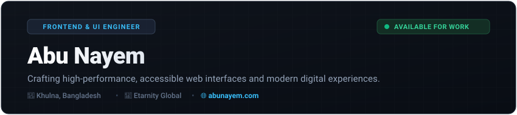

<div align="center">

  <!-- Hero Banner -->
  <a href="https://abunayem.com" target="_blank">
    
  </a>

  <br /><br />

  <!-- Navigation Bar -->
  <p align="center">
    <a href="#-about-me"><b>About Me</b></a> •
    <a href="#-tech-stack--skills-matrix"><b>Tech Stack</b></a> •
    <a href="#-featured-projects"><b>Featured Projects</b></a> •
    <a href="#-github-activity--analytics"><b>GitHub Analytics</b></a> •
    <a href="#-engineering-philosophy"><b>Philosophy</b></a> •
    <a href="#-connect--social-nexus"><b>Connect</b></a>
  </p>

  <!-- Quick Status Badges -->
  <p align="center">
    <a href="https://abunayem.com" target="_blank">
      
    </a>
    <a href="https://www.linkedin.com/in/nayem2004/" target="_blank">
      
    </a>
    <a href="https://wa.me/8801764467266" target="_blank">
      
    </a>
    <a href="mailto:mdnayem1100khan@gmail.com">
      
    </a>
  </p>

  <p align="center">
    
    
    
  </p>

</div>

---

### 👨‍💻 About Me

Hello world! 👋 I am **Abu Nayem**, a passionate **Frontend & Web Developer** based in **Khulna, Bangladesh**, currently contributing to frontend engineering at **Etarnity Global**.

I specialize in translating sophisticated design concepts into clean, accessible, and high-performance digital products. My core focus centers on the modern **JavaScript/TypeScript and React ecosystem**, creating responsive interfaces that deliver seamless user experiences across devices.

#### 📌 Executive Summary
```text
Role         : Frontend & Web Developer
Organization : Etarnity Global
Location     : Khulna, Bangladesh 🇧🇩
Core Focus   : React.js, Next.js, Modern JavaScript, UI/UX Engineering
Website      : https://abunayem.com
Status       : Available for freelance projects, open-source work & full-time roles
```

#### ⚡ What I'm Up To:
- 💼 **Currently Working**: Engineering client-facing frontend architectures at **Etarnity Global**.
- 🔭 **Current Projects**: Building fullstack web experiences, component libraries, and interactive web tools.
- 🌱 **Learning & Exploring**: Advanced Next.js 15 App Router paradigms, Server Components, and AI-augmented dev workflows.
- 🎯 **Engineering Goals**: Writing modular, maintainable code with strict attention to performance budgets and accessibility (a11y).
- 💬 **Ask Me About**: `HTML5`, `CSS3 / Tailwind`, `JavaScript (ES6+)`, `React.js`, `Responsive Layouts`, and `Modern Web Design`.
- ⚡ **Personal Motto**: *"Great software is where clean architecture meets intuitive user experience."*

---

### 🛠️ Tech Stack & Skills Matrix

A comprehensive breakdown of languages, frameworks, libraries, and tools I utilize in production environments:

<div align="center">

#### 💻 Frontend & Core Technologies
<p align="center">
  <a href="https://skillicons.dev">
    
  </a>
</p>

#### ⚙️ Backend, AI & Development Tooling
<p align="center">
  <a href="https://skillicons.dev">
    
  </a>
</p>

</div>

<br />

| Domain | Technologies & Skills |
| :--- | :--- |
| **Languages** | `JavaScript (ES6+)`, `TypeScript`, `HTML5`, `CSS3`, `Python (Basics)`, `Markdown` |
| **Frontend Frameworks** | `React.js`, `Next.js (App Router)`, `Vite`, `Component Architecture`, `State Management` |
| **Styling & UI Systems** | `Tailwind CSS`, `Sass/SCSS`, `Bootstrap 5`, `CSS Modules`, `Responsive Design`, `Mobile-First` |
| **Backend & APIs** | `Node.js`, `Express.js`, `RESTful APIs`, `Fetch / Axios`, `JSON Web Tokens` |
| **Developer Tools** | `Git`, `GitHub`, `VS Code`, `Postman`, `npm / yarn / pnpm`, `Chrome DevTools` |
| **Design & Prototyping**| `Figma`, `Wireframing`, `UI/UX Principles`, `Cross-Browser Compatibility` |

---

### 🚀 Featured Projects

A curated selection of repositories demonstrating my frontend capabilities, responsive architecture, and code quality:

| Project | Description | Tech Stack | Status & Links |
| :--- | :--- | :--- | :--- |
| **[Pixel Programmers](https://github.com/abunayem04/pixel-programmers-)** | Collaborative educational portal designed for programmers and developers to share knowledge and master web technologies. | `HTML5` `CSS3` `JavaScript` | [Source Code ➔](https://github.com/abunayem04/pixel-programmers-) |
| **[NX Restaurant](https://github.com/abunayem04/NX-resturent)** | Modern, fully responsive culinary website featuring interactive menus, chef highlights, and reservation interfaces. | `HTML5` `CSS3` `Responsive Design` | [Source Code ➔](https://github.com/abunayem04/NX-resturent) |
| **[Personal Portfolio](https://github.com/abunayem04/first-portfolio-)** | Official personal web portfolio demonstrating modern UI interactions, client case studies, and creative web experiments. | `Modern Web` `UI/UX` `JavaScript` | [Source Code ➔](https://github.com/abunayem04/first-portfolio-) • [Live Demo 🌐](https://abunayem.com) |
| **[Frontend Lab & UI Experiments](https://github.com/abunayem04/Practice-work)** | Collection of component prototypes, layout experiments, JavaScript algorithms, and design system modules. | `CSS Architecture` `DOM API` `JS` | [Source Code ➔](https://github.com/abunayem04/Practice-work) |

---

### 📊 GitHub Activity & Analytics

Real-time telemetry and statistics reflecting my coding activity, languages, and consistency:

<div align="center">
  <table border="0" cellspacing="0" cellpadding="0">
    <tr>
      <td align="center" width="50%" valign="top">
        
      </td>
      <td align="center" width="50%" valign="top">
        
      </td>
    </tr>
    <tr>
      <td colspan="2" align="center" valign="top">
        
      </td>
    </tr>
  </table>
</div>

<!-- Contribution Snake Arcade -->
<div align="center">
  <br />
  <picture>
    <source media="(prefers-color-scheme: dark)" srcset="https://raw.githubusercontent.com/abunayem04/abunayem04/output/github-contribution-grid-snake-dark.svg">
    <source media="(prefers-color-scheme: light)" srcset="https://raw.githubusercontent.com/abunayem04/abunayem04/output/github-contribution-grid-snake.svg">
    
  </picture>
</div>

---

### 💡 Engineering Philosophy & Workflow

My approach to building software and delivering dependable frontend systems:

- ⚡ **Performance-First**: Fast load times, clean asset pipelines, and optimal rendering performance are non-negotiable.
- 📱 **Mobile-First & Responsive**: Designed to scale flawlessly from 320px mobile screens to high-resolution 4K desktop displays.
- ♿ **Accessibility & Standards**: Semantic HTML, readable color contrasts, and clean keyboard navigation compliance.
- 🧩 **Modular Architecture**: Component reusability, DRY principles, and maintainable project structures.
- 🎨 **Attention to Micro-Interactions**: Smooth state transitions, subtle hover states, and intuitive UX flows that delight users.

#### 💻 Daily Driver & Setup:
```text
Editor   : Visual Studio Code (Tokyo Night / One Dark Pro)
Terminal : PowerShell & Git Bash with Oh My Posh
Hardware : High-performance multi-display workstation
Browser  : Google Chrome & Firefox Developer Edition
```

---

### 💬 Thought of the Day

<div align="center">
  
</div>

---

### 📬 Connect & Social Nexus

I am always open to discussing new web projects, innovative startup ideas, open-source collaborations, or software opportunities. Let's connect!

<div align="center">
  <a href="https://abunayem.com" target="_blank">
    
  </a>
  <a href="https://www.linkedin.com/in/nayem2004/" target="_blank">
    
  </a>
  <a href="https://wa.me/8801764467266" target="_blank">
    
  </a>
  <a href="https://www.facebook.com/abunayem04" target="_blank">
    
  </a>
  <a href="https://www.instagram.com/abu_nayeeem/" target="_blank">
    
  </a>
  <a href="mailto:mdnayem1100khan@gmail.com">
    
  </a>
</div>

<br />

<div align="center">
  <a href="#abunayem04"><b>▲ Return to Top</b></a>
  <br /><br />
  
  <p align="center"><i>⭐ Star this repository if you find it inspirational! ⭐</i></p>
</div>
