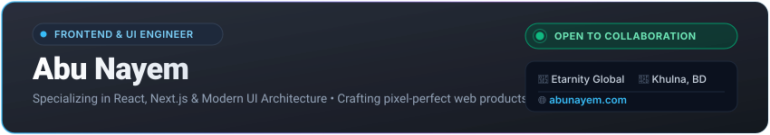

<div align="center">

  <!-- 3D Developer Illustrated Hero Banner -->
  <a href="https://abunayem.com" target="_blank">
    
  </a>

  <br /><br />

  <!-- Glassmorphic Executive Header -->
  

  <br /><br />

  <!-- Navigation Matrix -->
  <p align="center">
    <a href="#-about-me"><b>About</b></a> •
    <a href="#-tech-ecosystem"><b>Ecosystem</b></a> •
    <a href="#-featured-projects"><b>Projects</b></a> •
    <a href="#-github-telemetry"><b>Telemetry</b></a> •
    <a href="#-engineering-principles"><b>Principles</b></a> •
    <a href="#-connect"><b>Connect</b></a>
  </p>

  <!-- Quick Action Badges -->
  <p align="center">
    <a href="https://abunayem.com" target="_blank">
      
    </a>
    <a href="https://www.linkedin.com/in/nayem2004/" target="_blank">
      
    </a>
    <a href="https://wa.me/8801764467266" target="_blank">
      
    </a>
    <a href="mailto:mdnayem1100khan@gmail.com">
      
    </a>
  </p>

  <p align="center">
    
    
    
  </p>

</div>

---

### 👨‍💻 About Me

```tsx
// app/engineer/page.tsx
import { Developer, Stack, Organization } from '@/ecosystem';

export const metadata = {
  title: 'Abu Nayem — Frontend & UI Engineer',
  description: 'Specializing in React, Next.js, TypeScript & Modern UI Architecture',
};

export default async function Profile() {
  return (
    <Developer
      name="Abu Nayem"
      role="Frontend & UI Engineer"
      company="Etarnity Global"
      location="Khulna, Bangladesh 🇧🇩"
      coreStack={['Next.js 15', 'React 19', 'TypeScript', 'Tailwind CSS']}
      status="Open to High-Impact Opportunities & Freelance"
      portfolio="https://abunayem.com"
    />
  );
}
```

I am a **Frontend & UI Engineer** based in **Khulna, Bangladesh**, currently contributing to frontend architecture and product development at **Etarnity Global**.

My focus centers on the **React and Next.js ecosystem**, bridging design and code to create web experiences that are not just visually captivating, but also blazingly fast, accessible, and maintainable.

#### 📌 At a Glance
- 💼 **Current Role**: Frontend Developer at **Etarnity Global**
- 🌐 **Personal Website**: [abunayem.com](https://abunayem.com)
- 📍 **Location**: Khulna, Bangladesh
- 🎯 **Specialization**: React.js, Next.js, Modern JavaScript (ES6+), TypeScript, Tailwind CSS
- 💡 **Engineering Philosophy**: Sub-second load times, component reusability, and accessible UX
- 🤝 **Collaborations**: Open to freelance contracts, open-source projects, and full-time roles

---

### 🛠️ Tech Ecosystem

<div align="center">

#### 💻 Frontend Architecture & Core Technologies
<p align="center">
  <a href="https://skillicons.dev">
    
  </a>
</p>

#### ⚙️ Backend, AI & Development Tools
<p align="center">
  <a href="https://skillicons.dev">
    
  </a>
</p>

</div>

<br />

| Domain | Technologies & Systems | Focus Area |
| :--- | :--- | :--- |
| **01 // Core Frontend** | `React.js`, `Next.js 15 (App Router)`, `TypeScript`, `JavaScript (ES6+)` | Client & Server Components, State Management |
| **02 // UI & Styling** | `Tailwind CSS`, `Sass/SCSS`, `Bootstrap 5`, `CSS Modules`, `Responsive Design` | Design Systems, Fluid Layouts, 60fps Micro-interactions |
| **03 // Backend & API** | `Node.js`, `Express.js`, `RESTful APIs`, `Fetch / Axios`, `JWT` | API Integrations, Data Hydration, Authentication |
| **04 // Developer Tooling**| `Git`, `GitHub`, `VS Code`, `Vite`, `Postman`, `npm / yarn / pnpm` | Version Control, CI/CD Workflows, Code Optimization |
| **05 // Prototyping & UX** | `Figma`, `Wireframing`, `Design Tokens`, `Accessibility (a11y)` | Design-to-Code Parity, Responsive UX Research |

---

### 🚀 Featured Projects

| Project | Architecture & Description | Tech Stack | Status & Access |
| :--- | :--- | :--- | :--- |
| **[Pixel Programmers](https://github.com/abunayem04/pixel-programmers-)** | Collaborative web learning portal engineered for developers and students to share knowledge and master web technologies. | `HTML5` `CSS3` `JavaScript` `Responsive` | [Source Code ➔](https://github.com/abunayem04/pixel-programmers-) |
| **[NX Restaurant](https://github.com/abunayem04/NX-resturent)** | Modern dining & culinary web application featuring interactive dynamic menu filtering, rich aesthetic UI, and fast reservation flows. | `HTML5` `CSS3` `UI/UX Design` | [Source Code ➔](https://github.com/abunayem04/NX-resturent) |
| **[Portfolio Nexus](https://github.com/abunayem04/first-portfolio-)** | Official personal web portfolio demonstrating design system prototypes, creative UI components, and real-world client experiments. | `Next.js` `Tailwind` `React` `Modern Web` | [Source Code ➔](https://github.com/abunayem04/first-portfolio-) • [Live Demo 🌐](https://abunayem.com) |
| **[Frontend Labs](https://github.com/abunayem04/Practice-work)** | Component R&D sandbox containing experimental layout architectures, micro-interactions, and modern JavaScript design patterns. | `Component Lab` `DOM API` `CSS3` | [Source Code ➔](https://github.com/abunayem04/Practice-work) |

---

### 📊 GitHub Telemetry & Activity

<div align="center">
  <table border="0" cellspacing="0" cellpadding="0">
    <tr>
      <td align="center" width="50%" valign="top">
        
      </td>
      <td align="center" width="50%" valign="top">
        
      </td>
    </tr>
    <tr>
      <td colspan="2" align="center" valign="top">
        
      </td>
    </tr>
  </table>
</div>

<!-- Contribution Grid Snake -->
<div align="center">
  <br />
  <picture>
    <source media="(prefers-color-scheme: dark)" srcset="https://raw.githubusercontent.com/abunayem04/abunayem04/output/github-contribution-grid-snake-dark.svg">
    <source media="(prefers-color-scheme: light)" srcset="https://raw.githubusercontent.com/abunayem04/abunayem04/output/github-contribution-grid-snake.svg">
    
  </picture>
</div>

---

### 💡 Engineering Principles

- **⚡ Performance First**: Sub-second Largest Contentful Paint (LCP), minimal bundle sizes, and aggressive asset caching.
- **📱 Fluid & Responsive**: Mobile-first design paradigms ensuring smooth, pixel-perfect scaling across all device viewports.
- **♿ Inclusive & Accessible (a11y)**: Semantic HTML markup, keyboard-navigable workflows, and strict WCAG contrast compliance.
- **🧩 Component-Driven Architecture**: Modular, reusable, and self-contained components following clean DRY principles.
- **🔮 Modern Velocity**: Leveraging AI-augmented developer tooling to accelerate execution while enforcing strict code quality.

---

### 💬 Thought of the Day

<div align="center">
  
</div>

---

### 📬 Connect & Collaborate

Looking to collaborate on a web project, discuss frontend architecture, or hire for engineering roles? Let's connect:

<div align="center">
  <a href="https://abunayem.com" target="_blank">
    
  </a>
  <a href="https://www.linkedin.com/in/nayem2004/" target="_blank">
    
  </a>
  <a href="https://wa.me/8801764467266" target="_blank">
    
  </a>
  <a href="https://www.facebook.com/abunayem04" target="_blank">
    
  </a>
  <a href="https://www.instagram.com/abu_nayeeem/" target="_blank">
    
  </a>
  <a href="mailto:mdnayem1100khan@gmail.com">
    
  </a>
</div>

<br />

<div align="center">
  <a href="#abunayem04"><b>▲ Return to Top</b></a>
  <br /><br />
  
  <p align="center"><i>⭐ Star this repository if you find it inspirational! ⭐</i></p>
</div>
