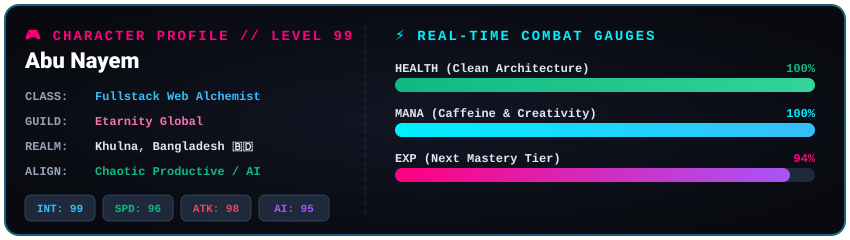

<div align="center">

  <!-- Animated Glowing Cyberpunk Hero Banner -->
  

  <br /><br />

  <!-- Animated Real-Time Typing HUD -->
  <a href="https://abunayem.com" target="_blank">
    
  </a>

  <br />

  <!-- Gamified Status Bar & Shields -->
  <p align="center">
    
    
    
    
  </p>

  <p align="center">
    <a href="https://abunayem.com" target="_blank">
      
    </a>
    <a href="https://www.linkedin.com/in/nayem2004/" target="_blank">
      
    </a>
    <a href="https://wa.me/8801764467266" target="_blank">
      
    </a>
    <a href="mailto:mdnayem1100khan@gmail.com">
      
    </a>
  </p>

  <p align="center">
    
  </p>

</div>



<!-- 🎮 RPG CHARACTER STATS & HUD -->
## 🎮 Player 1: Character Sheet & HUD

<div align="center">
  
</div>

```yaml
╔═══════════════════════════════════════════════════════════════════════════════╗
║                          🕹️ HERO DOSSIER: ABU NAYEM                           ║
╠═══════════════════════════════════════════════════════════════════════════════╣
║  👑 TITLE:         Fullstack Web Architect & AI Technomancer                 ║
║  ⭐ RANK:          S-Tier Developer (Lv. 99)                                  ║
║  🛡️ GUILD:         Etarnity Global                                            ║
║  📍 SPAWN POINT:   Khulna, Bangladesh 🇧🇩                                      ║
║  ❤️ HEALTH (HP):   ████████████████████ 100% [Pixel-Perfect Responsive UIs]   ║
║  ⚡ MANA (MP):     ████████████████████ 100% [Infinite Creative Drive]        ║
║  ⚔️ WEAPONRY:      JavaScript, React.js, Next.js, Tailwind CSS                ║
║  🔮 SPELLCASTING:  AI Prompt Engineering, Agentic Workflows, Fullstack APIs   ║
║  🏆 ULTIMATE:      Turning Ideas into Stunning, Interactive Digital Reality  ║
╚═══════════════════════════════════════════════════════════════════════════════╝
```

<!-- RETRO PACMAN DIVIDER -->
<div align="center">
  
</div>

<!-- ⚔️ WEAPONS & TECH INVENTORY -->
## ⚔️ Combat Arsenal & Tech Inventory

<div align="center">

### 🗡️ Primary Blades (Frontend Weaponry)
<p align="center">
  <a href="https://skillicons.dev">
    
  </a>
</p>

### 🛡️ Shields, Magic & AI (Backend & Intelligence)
<p align="center">
  <a href="https://skillicons.dev">
    
  </a>
</p>

### 🎒 Special Equipment & Runes (Tools & DevOps)
<p align="center">
  <a href="https://skillicons.dev">
    
  </a>
</p>

</div>


<!-- 📊 BATTLE ARENA & LIVE TELEMETRY -->
## 📊 Battle Arena & Live Telemetry

<div align="center">
  <table border="0">
    <tr>
      <td align="center" width="50%">
        
      </td>
      <td align="center" width="50%">
        
      </td>
    </tr>
    <tr>
      <td colspan="2" align="center">
        
      </td>
    </tr>
  </table>
</div>

<!-- 🐍 RETRO SNAKE ARCADE GAME -->
<div align="center">
  <h3>🐍 Retro Snake: Consuming GitHub Contributions</h3>
  <picture>
    <source media="(prefers-color-scheme: dark)" srcset="https://raw.githubusercontent.com/abunayem04/abunayem04/output/github-contribution-grid-snake-dark.svg">
    <source media="(prefers-color-scheme: light)" srcset="https://raw.githubusercontent.com/abunayem04/abunayem04/output/github-contribution-grid-snake.svg">
    
  </picture>
</div>


<!-- 📜 QUEST LOG & ACHIEVEMENTS -->
## 📜 Quest Log & Campaign Progress

```diff
+ [x] ⚔️ QUEST 01: Master Core Foundations (Semantic HTML5 & Modern CSS3)  [COMPLETED]
+ [x] ⚔️ QUEST 02: Vanquish Asynchronous JS & Conquer the Browser DOM     [COMPLETED]
+ [x] ⚔️ QUEST 03: Forge High-Impact Responsive Web Experiences          [COMPLETED]
! [ ] 🛡️ QUEST 04: Conquer Fullstack React & Next.js Ecosystems          [IN PROGRESS - 85%]
! [ ] 🔮 QUEST 05: Master Autonomous AI Agents & Intelligent Web Apps    [IN PROGRESS - 70%]
- [ ] 👑 QUEST 06: Launch Scalable Global SaaS Empire                    [LOCKED - RAID INCOMING]
```


<!-- 🚀 FEATURED BOSS RAIDS (PROJECTS) -->
## 🚀 Featured Boss Raids & Dungeons

| Raid Target | Mission Brief | Loadout | Teleport Link |
| :--- | :--- | :--- | :--- |
| **🎮 Pixel Programmers** | Interactive developer learning arena & training ground | `HTML5` `CSS3` `JS` | [⚔️ Enter Arena](https://github.com/abunayem04/pixel-programmers-) |
| **🍽️ NX Restaurant** | Futuristic culinary web portal with dynamic menus | `Responsive` `UI/UX` | [⚔️ Explore Portal](https://github.com/abunayem04/NX-resturent) |
| **💼 Player Portfolio** | The official nexus showcasing creations & experiments | `Web Dev` `Design` | [⚔️ Inspect Portfolio](https://github.com/abunayem04/first-portfolio-) |
| **🧪 Battle Labs** | Experimental frontend lab testing cutting-edge concepts | `Laboratory` `R&D` | [⚔️ Enter Lab](https://github.com/abunayem04/Practice-work) |


<!-- 🌐 SUMMONING CHANNELS (CONNECT) -->
## 📡 Summoning Portal // Connect With Player 1

<div align="center">
  <p>Looking to assemble a party for epic projects, open-source raids, or tech discussions?</p>

  <a href="https://abunayem.com" target="_blank">
    
  </a>
  <a href="https://www.linkedin.com/in/nayem2004/" target="_blank">
    
  </a>
  <a href="https://wa.me/8801764467266" target="_blank">
    
  </a>
  <a href="https://www.facebook.com/abunayem04" target="_blank">
    
  </a>
  <a href="https://www.instagram.com/abu_nayeeem/" target="_blank">
    
  </a>
  <a href="mailto:mdnayem1100khan@gmail.com">
    
  </a>
</div>

<br />

<!-- FOOTER ANIMATION -->
<div align="center">
  
  <p align="center"><i>⚡ "Code is the modern magic. Every function is a spell." ⚡</i></p>
  <p align="center"><strong>⭐ Press ⭐ on repositories to give +100 EXP! ⭐</strong></p>
</div>
